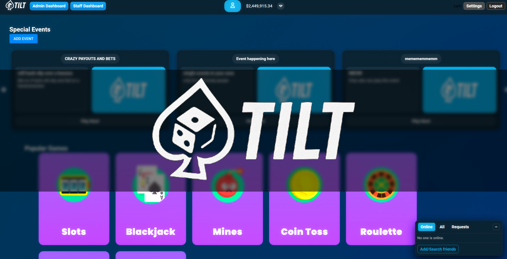

# Tilt Project

> This is a learning project that combines a React/Vite frontend with a FastAPI backend.  
> It includes casino game UIs, Firebase Auth/Firestore, and Stripe-powered deposits/withdrawals.



---

## Table of Contents
- [Project Structure](#project-structure)
- [Requirements](#requirements)
- [Environment Variables](#environment-variables)
- [Build Scripts](#build-scripts)
- [Stripe listener](#stripe-listener)
- [API & Data](#api--data)
- [Included Packages](#included-packages)

---

## Project Structure

The repository has the following structure:

- **[Backend/](Backend/)** — backend server
  - **[firebase/](Backend/firebase/)** — Firebase setup and admin SDK
  - **[routers/](Backend/routers/)** — FastAPI routers (incl. Stripe endpoints)
- **[public/](public/)** — static assets
- **[src/](src/)** — frontend and game components

---

## Requirements

- **Node.js** ≥ 18
- **Python** ≥ 3.10
- **Stripe CLI** (for local webhooks)
- **Firebase** project (Web config + Admin Service Account)

---

## Environment Variables

> `.env` files are **gitignored**. Create them locally.

### Backend (root `.env`)
```dotenv
# Stripe
STRIPE_SECRET_KEY=sk_test_xxx
STRIPE_WEBHOOK_SECRET=whsec_xxx

# Firebase Admin
GOOGLE_APPLICATION_CREDENTIALS=./Backend/firebase/serviceAccount.json
```

---

## **Build Scripts**

# 1) Frontend
```
cd COMP602-Tilt
npm install
npm run dev         # -> http://localhost:5173
```

# 2) Backend (new terminal)
```
pip install -r requirements.txt
python -m uvicorn Backend.main:app --reload --port 4000  # -> http://localhost:4000
```

# 3) Stripe webhooks (new terminal) * Requires the setup below
```
stripe login
stripe listen --forward-to http://localhost:4000/payments/webhook
```

---

### **Stripe listener**
To receive Stripe webhook events locally, you need the Stripe CLI.

**Installation**
```
# 1. Download the latest Stripe CLI ZIP (done once)
$Headers = @{ "User-Agent" = "ps1-installer" }
$release = Invoke-RestMethod -Headers $Headers -Uri "https://api.github.com/repos/stripe/stripe-cli/releases/latest"
$asset = $release.assets | Where-Object { $_.name -match "windows.*x86_64.*\.zip$" } | Select-Object -First 1
$zip = Join-Path $env:TEMP "stripe-cli.zip"
Invoke-WebRequest -Headers $Headers -Uri $asset.browser_download_url -OutFile $zip

# 2. Extract to a user-local folder
$dest = Join-Path $env:LOCALAPPDATA "Programs\StripeCLI"
New-Item -ItemType Directory -Force -Path $dest | Out-Null
Expand-Archive -Path $zip -DestinationPath $dest -Force

# 3. Put stripe.exe in $dest
$exe = Get-ChildItem -Path $dest -Recurse -Filter "stripe.exe" | Select-Object -First 1
if ($exe.DirectoryName -ne $dest) { Copy-Item $exe.FullName -Destination (Join-Path $dest "stripe.exe") -Force }

# 4. Add to PATH (current + persist)
if ($env:Path -notlike "*$dest*") { $env:Path = "$dest;$env:Path" }
$existing = [Environment]::GetEnvironmentVariable("Path","User")
if ($existing -notlike "*$dest*") { [Environment]::SetEnvironmentVariable("Path","$dest;$existing","User") }

# 5. Verify installation
stripe --version
```
**Running**
```
# Authenticate with Stripe (opens browser)
stripe login

# Forward webhook events to FastAPI backend
stripe listen --forward-to http://localhost:4000/payments/webhook
```

---

## API & Data

>Backend base: http://localhost:4000
>
>Routers: see Backend/routers/ (payments, game endpoints, etc.)
>
>Firestore: collections like games/{gameId}/players/{uid}, plus ledgers.

## **Included Packages**

**Python packages (requirements.txt)**
fastapi==0.116.1

uvicorn==0.35.0

firebase-admin==7.1.0

google-cloud-firestore==2.21.0

pydantic==2.11.7

---

**Typescript packages (package.json)**

Dependencies

@emotion/react — ^11.14.0

@emotion/styled — ^11.14.1

@mui/icons-material — ^7.3.1

@mui/material — ^7.3.1

@stripe/stripe-js — ^7.9.0

@toolpad/core — ^0.16.0

firebase — ^12.1.0

react — ^19.1.0

react-dom — ^19.1.0

react-router-dom — ^7.8.2

react-slick — ^0.31.0

slick-carousel — ^1.8.1

Dev Dependencies

@eslint/js — ^9.30.1

@types/react — ^19.1.8

@types/react-dom — ^19.1.6

@types/react-slick — ^0.23.13

@vitejs/plugin-react — ^4.6.0

eslint — ^9.30.1

eslint-plugin-react-hooks — ^5.2.0

eslint-plugin-react-refresh — ^0.4.20

globals — ^16.3.0

typescript — ~5.8.3

typescript-eslint — ^8.35.1

vite — ^7.0.4

